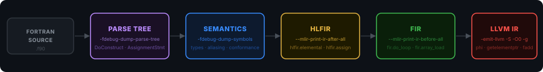
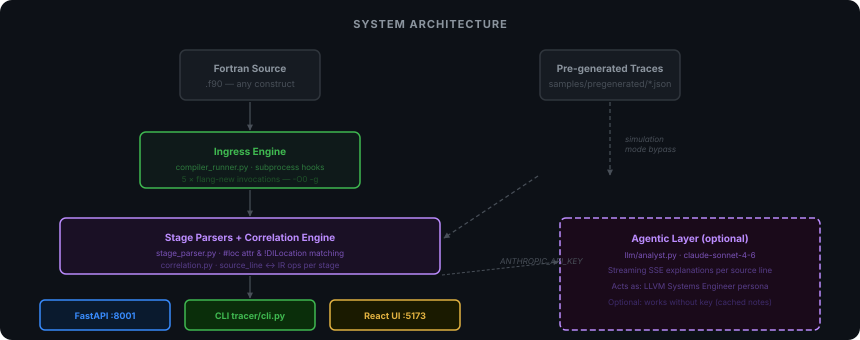
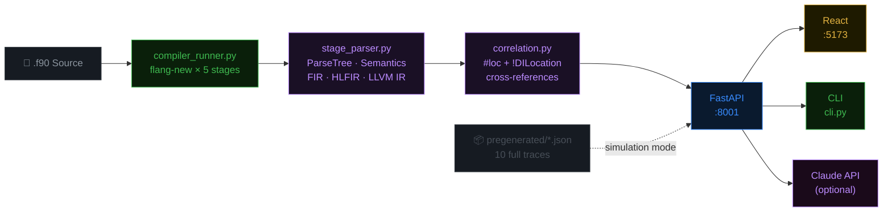

<div align="center">

<br/>

```
  ⬡ fpc-trace
```

# Flang Pipeline Construct Tracer

**The first tool that makes Flang's compilation pipeline fully transparent.**

*Trace any Fortran construct through every stage of Flang's unique multi-level IR —*  
*Parse Tree → Semantics → FIR → HLFIR → LLVM IR — with deterministic cross-stage correlation.*

<br/>

[](https://python.org)
[](https://fastapi.tiangolo.com)
[](https://react.dev)
[](tests/test_parsers.py)
[](LICENSE)
[](docs/reference/ASSIGNMENT_33_BRIEF.md)

<br/>



<br/>
<br/>

> **No Flang install required.** Ten curated, production-quality Fortran constructs ship pre-traced.  
> All five pipeline stages. All correlations. All lowering patterns. Ready to explore in seconds.

<br/>

[**Quick Start**](#-quick-start) · [**Features**](#-features) · [**10 Constructs**](#-the-10-constructs) · [**Architecture**](#-architecture) · [**API**](#-api-reference) · [**Docs**](#-documentation)

</div>

---

## ⚡ The Problem

Flang is the LLVM Fortran compiler — the only actively maintained open-source Fortran compiler with a future. It compiles your `.f90` source through **five distinct intermediate representations** before producing machine code:

```
Fortran Source
    │
    ▼  -fdebug-dump-parse-tree
Parse Tree          ← syntactic structure, no types
    │
    ▼  -fdebug-dump-symbols
Semantics           ← types resolved, aliasing checked, conformance verified
    │
    ▼  --mlir-print-ir-after-all
HLFIR               ← High-Level FIR: array semantics preserved as value types
    │
    ▼  --mlir-print-ir-before-all
FIR                 ← Fortran IR: loops materialised, memory model applied
    │
    ▼  -emit-llvm -S
LLVM IR             ← target-independent instructions, vectoriser input
    │
    ▼
Machine Code
```

**The catch:** no existing tool lets you see how a single source construct flows through *all five* of these levels simultaneously. Developers currently:

1. Run `flang-new -fdebug-dump-parse-tree` → get thousands of lines of parse tree text
2. Run `flang-new -emit-fir --mlir-print-ir-after-all` → get thousands of lines of HLFIR MLIR
3. Run `flang-new -emit-llvm` → get LLVM IR
4. **Manually correlate** these dumps using source line numbers — an error-prone, time-consuming process for anything involving arrays, polymorphism, or coarrays

| Tool | Parse Tree | Semantics | FIR | HLFIR | LLVM IR | Cross-references |
|------|:---:|:---:|:---:|:---:|:---:|:---:|
| Godbolt | ❌ | ❌ | ❌ | ❌ | ✅ | ❌ |
| LLVM opt-viewer | ❌ | ❌ | ❌ | ❌ | ✅ | ❌ |
| flang-new dumps | ✅ | ✅ | ✅ | ✅ | ✅ | ❌ (manual) |
| **fpc-trace** | ✅ | ✅ | ✅ | ✅ | ✅ | ✅ **automatic** |

---

## ✨ Features

<table>
<tr>
<td width="50%">

### 🔬 Explore Mode
Browse 10 pre-traced Fortran constructs. Click any source line to see the exact IR it produces at every stage — Parse Tree nodes, HLFIR ops, FIR ops, LLVM instructions — all correlated automatically.

</td>
<td width="50%">

### ⟷ Compare Mode
Select any two constructs and compare them side-by-side at any pipeline stage. Unique operations on each side are highlighted. See exactly what the `unordered` attribute adds to DO CONCURRENT vs a plain DO loop.

</td>
</tr>
<tr>
<td>

### ⚡ Pattern Analyzer
Paste any Fortran source into the live editor. Constructs are detected in real time and matched against the pre-generated trace library. See the predicted lowering chain for your code — without a Flang install.

</td>
<td>

### 🔍 Global IR Search  `⌘K`
Search all 50 IR dumps (10 constructs × 5 stages) simultaneously. Find every use of `hlfir.elemental`, every `_caf_get` call, every `unordered` attribute across the entire construct library in milliseconds.

</td>
</tr>
<tr>
<td>

### 🏎 Vertical Trace Flow
Click a source line and watch the transformation chain animate: a stacked card for each stage, showing the exact ops produced, the lowering role, and performance intelligence badges.

</td>
<td>

### 📊 Performance Intelligence
Every construct is automatically profiled for: SIMD vectorizability ⚡, virtual dispatch 🔗, heap allocations 📦, CAF distribution 🌐, recursion 🔄, sync barriers 🚧. Badges appear on sidebar cards.

</td>
</tr>
<tr>
<td>

### 🤖 AI Analysis  (optional)
With `ANTHROPIC_API_KEY` set, clicking any source line streams a real-time technical explanation from Claude acting as an LLVM Systems Engineer — narrating the lowering decisions, constraints, and optimization implications.

</td>
<td>

### 📦 Three Output Formats
The CLI produces clean terminal output (text), machine-readable traces (JSON), and standalone offline HTML reports with full syntax highlighting — no server required to view or share.

</td>
</tr>
</table>

---

## 🚀 Quick Start

**No dependencies except Python 3.10+. No Flang install needed for the demo.**

```bash
# Clone
git clone <repo-url> && cd cd-el-repo

# One-command start (backend + frontend)
./scripts/start.sh

# → Dashboard:  http://localhost:5173
# → API docs:   http://localhost:8001/docs
```

<details>
<summary><strong>Manual setup (step by step)</strong></summary>

```bash
# Backend
cd tracer/backend
python3 -m venv .venv && source .venv/bin/activate
pip install fastapi uvicorn pydantic python-dotenv httpx sse-starlette aiofiles
uvicorn main:app --port 8001

# Frontend (new terminal)
cd tracer/frontend
npm install
npm run dev -- --port 5173
```

</details>

**CLI — no Node.js required:**

```bash
python3 tracer/cli.py --list                         # browse all 10 constructs
python3 tracer/cli.py 02_do_concurrent               # full terminal trace
python3 tracer/cli.py --stage hlfir 06_polymorphism  # single-stage deep dive
python3 tracer/cli.py --line 8 02_do_concurrent      # focus one source line
python3 tracer/cli.py --json 03_where_block          # machine-readable JSON
python3 tracer/cli.py --output report.html 07_coarray  # offline HTML report
python3 tracer/cli.py --patterns                     # lowering patterns reference
```

**Live compile (requires flang-new):**

```bash
export FLANG_BINARY=flang-new
python3 tracer/cli.py tracer/backend/samples/02_do_concurrent.f90
python3 scripts/regenerate_pregenerated.py   # regenerate all 10 traces from real Flang
```

---

## 🗺 Architecture



<br/>

The tool has three layers, each independently testable:

```
┌─────────────────────────────────────────────────────────────────────┐
│  LAYER 1 — INGRESS                                                  │
│  compiler_runner.py                                                  │
│  Five subprocess invocations of flang-new, each with stage-specific │
│  flags to extract the raw IR for that level.  Falls back to         │
│  pre-generated JSON when no Flang binary is found.                  │
├─────────────────────────────────────────────────────────────────────┤
│  LAYER 2 — PARSING + CORRELATION                                     │
│  stage_parser.py   →  ParsedStage(content, key_ops, loc_map)        │
│  correlation.py    →  SourceCorrelation per source line             │
│                                                                     │
│  Correlation keys:                                                  │
│    FIR / HLFIR  : #loc("file.f90":line:col) attributes              │
│    LLVM IR      : !DILocation(line:N) + !dbg !N back-references     │
│    Parse Tree   : regex-matched node names + loc annotations        │
├─────────────────────────────────────────────────────────────────────┤
│  LAYER 3 — PRESENTATION                                              │
│  FastAPI :8001  →  10 REST endpoints + SSE streaming                 │
│  React :5173    →  Explore · Compare · Analyze modes                 │
│  CLI            →  text / --json / --output html                    │
│  LLM (optional) →  Claude SSE explanations per correlation          │
└─────────────────────────────────────────────────────────────────────┘
```

### Data Flow



---

## 🔟 The 10 Constructs

Each construct ships with a complete 5-stage trace, source-to-IR correlations, and lowering pattern documentation. See [`docs/CONSTRUCTS.md`](docs/CONSTRUCTS.md) for full detail on every construct.

| # | Construct | Standard | Complexity | Key Lowering Insight |
|---|-----------|:--------:|:----------:|----------------------|
| [01](tracer/backend/samples/pregenerated/01_array_assignment.json) | Array assignment `a = b + c` | F90 | 🟡 MEDIUM | `hlfir.elemental` → `fir.do_loop` + GEP+fadd in LLVM |
| [02](tracer/backend/samples/pregenerated/02_do_concurrent.json) | DO CONCURRENT loop | F2008 | 🟠 HIGH | `unordered` attribute survives to LLVM → auto-vectorizable |
| [03](tracer/backend/samples/pregenerated/03_where_block.json) | WHERE / ELSEWHERE | F90 | 🟠 HIGH | `arith.select` (branchless mask, no branch in loop body) |
| [04](tracer/backend/samples/pregenerated/04_forall.json) | FORALL statement | F95 | 🟠 HIGH | 2-D `hlfir.elemental` + Fortran column-major GEP |
| [05](tracer/backend/samples/pregenerated/05_derived_type.json) | Derived type field access | F90 | 🟡 MEDIUM | `fir.field_index` + `fir.coordinate_of` → multi-index GEP |
| [06](tracer/backend/samples/pregenerated/06_polymorphism.json) | Polymorphism + SELECT TYPE | F2003 | 🔴 VERY HIGH | `fir.dispatch_table` → vtable → indirect call |
| [07](tracer/backend/samples/pregenerated/07_coarray.json) | Coarray halo exchange | F2008 | 🔴 VERY HIGH | `_caf_get` / `_caf_put` + `_caf_sync_all` barrier |
| [08](tracer/backend/samples/pregenerated/08_intrinsics.json) | MATMUL / SUM / MAXVAL | F90 | 🟠 HIGH | `_FortranAMatmul` runtime ABI + descriptor boxing |
| [09](tracer/backend/samples/pregenerated/09_recursion.json) | Recursive function | F90 | 🟡 MEDIUM | `alloca` per frame; no tail-call optimisation in Flang |
| [10](tracer/backend/samples/pregenerated/10_generic_interface.json) | Generic interface | F90 | 🟡 MEDIUM | Compile-time overload → monomorphic `fir.call` + mangling |

**23 lowering patterns** discovered across these constructs. See [`docs/lowering-patterns.md`](docs/lowering-patterns.md).

---

## 📦 Assignment 33 — Deliverables

All five original deliverables are fully implemented.

| # | Deliverable | Where | What was built |
|---|-------------|-------|----------------|
| **D1** | Pipeline instrumentation hooks | [`engine/compiler_runner.py`](tracer/backend/engine/compiler_runner.py) | Five subprocess hooks with stage-specific Flang flags; `collect_pipeline_dumps.sh` for any `.f90`; `TRACK_B_HOOKS.md` documents the in-process alternative |
| **D2** | Cross-stage correlation engine | [`engine/correlation.py`](tracer/backend/engine/correlation.py) [`engine/stage_parser.py`](tracer/backend/engine/stage_parser.py) | Deterministic `#loc`/`!DILocation` matching; named-loc definition parsing; `_ops_at` returns real IR op names |
| **D3** | CLI: text / HTML / JSON | [`tracer/cli.py`](tracer/cli.py) | All three formats; `--line N` focus mode; `--stage`; live compile when `FLANG_BINARY` set |
| **D4** | 10 construct demonstrations | [`samples/pregenerated/`](tracer/backend/samples/pregenerated/) | Full 5-stage traces for all 10 constructs; reproducible via `regenerate_pregenerated.py` |
| **D5** | Lowering patterns reference | [`docs/lowering-patterns.md`](docs/lowering-patterns.md) | 14 patterns with IR excerpts; `GET /api/patterns` serves all 23 construct-level patterns |

**Beyond the brief:**

| Addition | Description |
|----------|-------------|
| 🌐 React dashboard | Explore · Compare · Analyze modes with syntax-highlighted IR viewer |
| 🔍 Global IR Search | Search all 50 stage dumps in real time (`⌘K`) |
| 📊 Performance Intelligence | Automatic LLVM IR analysis → badges: `⚡ SIMD eligible`, `🔗 virtual dispatch`, `📦 heap alloc`, `🌐 CAF distributed`, `🔄 recursive`, `🚧 sync barrier` |
| ⟷ Construct Comparison | Side-by-side diff of any two constructs at any stage |
| ⚡ Live Pattern Analyzer | Real-time construct detection in a Fortran editor; no compiler needed |
| 🤖 AI narration | SSE-streamed Claude explanations per source line |
| 🧪 111 pytest tests | Parser, correlation engine, classifier, and all 10 pre-generated traces |
| 📋 JSON Schema | `schemas/correlated_construct.schema.json` (Draft-07) |
| 🔎 Validation | `./scripts/validate_trace_json.sh` — structural + type checks |

---

## 📂 Repository Layout

```
cd-el-repo/
│
├── README.md                    ← you are here
├── CONTRIBUTING.md              Development guide, conventions
├── LICENSE                      MIT
│
├── tracer/
│   ├── cli.py                   Terminal tracer (text · JSON · HTML)
│   │
│   ├── backend/                 FastAPI application
│   │   ├── main.py              All API routes (10 endpoints)
│   │   ├── requirements.txt
│   │   ├── engine/
│   │   │   ├── compiler_runner.py   Subprocess hooks → CompileStageResult
│   │   │   ├── stage_parser.py      Per-stage text → ParsedStage + loc_map
│   │   │   └── correlation.py       Source line ↔ IR op name mapping
│   │   ├── llm/
│   │   │   ├── analyst.py           Claude SSE streaming
│   │   │   └── prompts/             System + user prompt templates
│   │   ├── models/
│   │   │   └── schemas.py           Pydantic v2: PipelineResult, SourceCorrelation…
│   │   └── samples/
│   │       ├── 01_array_assignment.f90  … 10_generic_interface.f90
│   │       └── pregenerated/
│   │           └── 01_array_assignment.json  … 10_generic_interface.json
│   │
│   └── frontend/                React + Vite dashboard
│       └── src/
│           ├── App.jsx          Root state + mode routing
│           └── components/
│               ├── Header.jsx           Pipeline bar + mode switcher
│               ├── Sidebar.jsx          Construct library + perf badges
│               ├── PipelineFlow.jsx     Stage selector with line counts
│               ├── SourceViewer.jsx     Syntax-highlighted Fortran + line markers
│               ├── StagePanel.jsx       Syntax-highlighted IR viewer
│               ├── AnalysisPanel.jsx    Cross-stage correlations
│               ├── TraceFlow.jsx        Animated vertical lowering chain
│               ├── SearchModal.jsx      ⌘K global IR search
│               ├── CompareView.jsx      Side-by-side construct diff
│               ├── PatternAnalyzer.jsx  Live Fortran editor
│               └── PatternsModal.jsx    Lowering patterns reference
│
├── scripts/
│   ├── start.sh                 One-command demo launcher
│   ├── collect_pipeline_dumps.sh   Collect 5-stage dumps from any .f90
│   ├── regenerate_pregenerated.py  Rebuild all JSON traces from live Flang
│   └── validate_trace_json.sh   Structural + schema validation
│
├── tests/
│   └── test_parsers.py          111 pytest tests
│
├── schemas/
│   └── correlated_construct.schema.json   JSON Schema Draft-07
│
└── docs/
    ├── lowering-patterns.md     14 Flang lowering patterns (developer reference)
    ├── TRACK_B_HOOKS.md         In-process vs subprocess instrumentation design
    ├── CONSTRUCTS.md            Deep dive on all 10 constructs
    ├── ARCHITECTURE.md          Full system architecture documentation
    ├── PROBLEM.md               Problem statement + background
    ├── FEATURES.md              Feature showcase and demo guide
    ├── design/
    │   └── ENGINEERING_DESIGN.md
    ├── reference/
    │   └── ASSIGNMENT_33_BRIEF.md
    └── assets/
        ├── pipeline.svg
        └── architecture.svg
```

---

## 🌐 API Reference

**Base URL:** `http://localhost:8001`  
**Interactive docs:** [http://localhost:8001/docs](http://localhost:8001/docs)

| Endpoint | Method | Description |
|----------|:------:|-------------|
| `/api/health` | `GET` | Status, mode (`simulation`/`real`), Flang version, construct count |
| `/api/constructs` | `GET` | All 10 construct summaries with category, complexity, key patterns |
| `/api/constructs/{id}` | `GET` | Full `PipelineResult`: source + all 5 stages + correlations |
| `/api/patterns` | `GET` | All 23 lowering patterns across constructs |
| `/api/search?q=…` | `GET` | Full-text search across all 50 IR dumps; optional `stage=` filter |
| `/api/compare/{a}/{b}?stage=` | `GET` | Side-by-side IR + unified diff + unique/shared op lists |
| `/api/metrics/{id}` | `GET` | Performance badges + LLVM instruction metrics + instruction mix |
| `/api/metrics` | `GET` | Metrics for all 10 constructs in one call |
| `/api/trace/{id}/line/{n}` | `GET` | Vertical lowering chain for one source line |
| `/api/pattern-analyze` | `POST` | Detect constructs in arbitrary Fortran source |
| `/api/explain` | `POST` | SSE: AI or cached `lowering_notes` for a source line |
| `/api/analyze` | `POST` | Compile custom `.f90` (requires `FLANG_BINARY`) |

---

## ⚙️ Environment Variables

| Variable | Default | Effect |
|----------|---------|--------|
| `ANTHROPIC_API_KEY` | *(unset)* | Enables live streaming AI analysis on line click; falls back gracefully to cached `lowering_notes` |
| `FLANG_BINARY` | `flang-new` | Path to flang-new for live compilation mode; simulation used otherwise |
| `PORT_BACKEND` | `8001` | FastAPI server port (`scripts/start.sh`) |
| `PORT_FRONTEND` | `5173` | Vite dev server port (`scripts/start.sh`) |

---

## 🧪 Development

```bash
# Run all 111 tests
pytest tests/ -v

# Validate all 10 pre-generated traces
./scripts/validate_trace_json.sh

# Regenerate traces from live Flang (requires flang-new)
FLANG_BINARY=flang-new python3 scripts/regenerate_pregenerated.py

# Collect dumps from a single .f90 file
./scripts/collect_pipeline_dumps.sh tracer/backend/samples/02_do_concurrent.f90
```

See [**CONTRIBUTING.md**](CONTRIBUTING.md) for code conventions, PR guidelines, and how to add new constructs.

---

## 📚 Documentation

| Document | Audience | Description |
|----------|----------|-------------|
| [**PROBLEM.md**](docs/PROBLEM.md) | All | The problem fpc-trace solves, with background and motivation |
| [**FEATURES.md**](docs/FEATURES.md) | Users | Feature showcase, demo guide, HPE walkthrough |
| [**CONSTRUCTS.md**](docs/CONSTRUCTS.md) | Fortran developers | All 10 constructs with complete lowering chains |
| [**ARCHITECTURE.md**](docs/ARCHITECTURE.md) | Developers | Full technical architecture, data flow, design decisions |
| [**lowering-patterns.md**](docs/lowering-patterns.md) | Flang developers | 14 key lowering patterns: Flang developer reference |
| [**TRACK_B_HOOKS.md**](docs/TRACK_B_HOOKS.md) | Compiler engineers | In-process MLIR instrumentation hook design (Track B) |
| [**ENGINEERING_DESIGN.md**](docs/design/ENGINEERING_DESIGN.md) | All | Complete design specification |

---

<div align="center">

**Compiler Design Lab · Assignment 33 · HPE Flang**

*Built with precision. Traced with purpose.*

[⬆ Back to top](#-flang-pipeline-construct-tracer)

</div>
